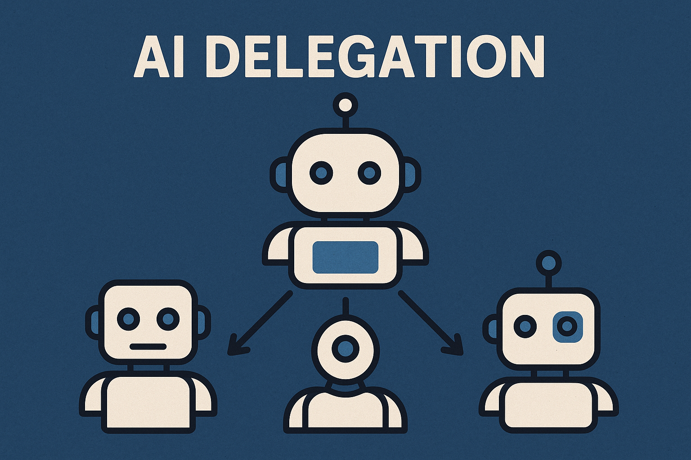
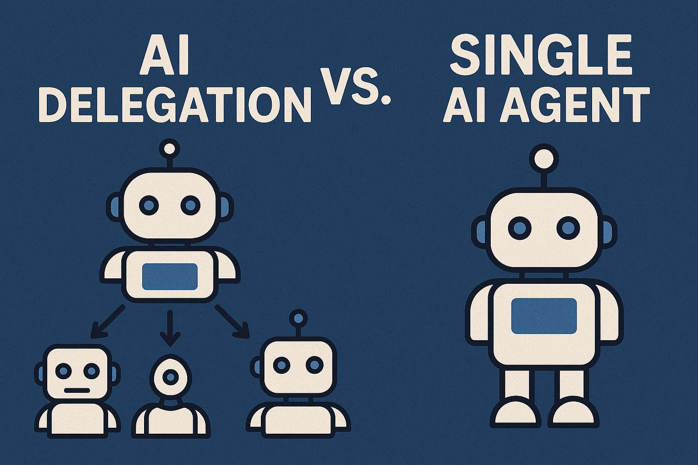

# Delegation RL
## Training LLMs to Delegate Tasks to Sub-Agents to Improve Performance
### Subjective Track
Multi-agent LLMs are becoming increasingly popular. Multi-agent frameworks enable LLMs to delegate tasks and execute them in parallel, which can significantly improve efficiency and performance. Current LLMs are not designed to handle multi-agent interactions natively. LLMs are finetuned to perform tasks in a single-agent setting and have limited capabilities when it comes to multi-agent interactions.

Delegation RL solves this problem by providing an environment for training an LLM to delegate tasks to sub-agents to improve its capabilities with the hope that a single user request could be delegated to multiple sub-agents, executing in parallel, and then the results can be aggregated to provide a final, more thorough response.

# How it Works
Delegation RL utilizes a simple hierarchical structure where a main agent (the delegator) can delegate tasks to multiple sub-agents (the delegates). Given a user request, the delegator breaks it down into 3-5 smaller tasks, which are then assigned to the sub-agents. Each sub-agent processes its task and returns a response. The delegator then aggregates these responses to provide a final answer to the user.



In order to evaluate the performance of the delegation system, we utilize LLM-as-a-Judge to evaluate the final response from the delegator compared with a response from a vanilla (single-agent) LLM. The judge scores each response and the delegator is scored based on the quality of its final response compared to the vanilla LLM response.

# Quickstart
To get started, run the following command and ensure that your OPENAI_API_KEY is set:
```bash
uv run environments/hack0/delegation_rl/delegation_env.py process
```

This will run the example delegation environment which uses GPT-4.1-nano for all models calls under the hood. To use different models, you can change the configurations in the `delegation_env.py` file. All output will be saved in `artifacts.json`. 


# Video
https://youtu.be/NxPz5DSyw50

# Wandb
https://api.wandb.ai/links/justinolcott-byu/30tnjy7d
- No added metrics

